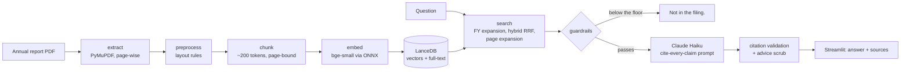

# Praman

*praman (प्रमाण): proof, evidence. Every claim carries its source.*

Ask a question about an Indian listed company's annual report and get an answer
where **every claim cites the page it came from** — or an honest *"Not in the
filing."* Currently covering Hindustan Construction Company's FY25 annual
report: 296 pages, 1,620 chunks.

<!-- TODO at deploy: add docs/demo.gif and the live Streamlit link here. -->

## Why

Aggregate financial data is a solved problem. What is not solved is **checking
a number**. A figure lifted from an annual report is useless for research
unless you also know three things the page knows and a chatbot usually loses:

- **Which page it came from**, so it can be verified in seconds.
- **Its unit.** "8,743.37" means nothing until the page says *₹ crore* — and
  one page of this filing is printed in lakhs.
- **Its scope.** Standalone and consolidated statements repeat the same row
  labels with different numbers, 80 pages apart.

Praman is built so that a claim without all three never reaches the reader.

## How it works



**Extraction keeps the page honest.** Running headers and footers are removed
by repetition, because the footer prints the report's *own* page number — two
behind the PDF page a citation must use. Tables printed sideways are turned
upright, two-column pages are re-ordered from block geometry, and table rows
are rebuilt from line positions so a label keeps its figures.

**Chunks carry their context.** A chunk inherits its page's statement title,
unit declaration and period header, so a chunk taken from the middle of a
balance sheet still knows it is the *standalone* one, reported in *₹ crore*,
*as at March 31, 2025*. Chunks never cross a page boundary — the page is the
citation unit.

**Retrieval is hybrid.** Questions say "FY25" while statements say "As at
March 31, 2025", so fiscal years are expanded to the dates the filing prints.
A vector ranking and LanceDB's full-text ranking are merged by reciprocal rank
fusion, then every retrieved page is widened to its neighbouring chunks: the
figure asked about often sits a chunk away from the wording that matched.

**Generation cites metadata, not text.** Each extract is labelled with the page
from its chunk record, and the model may cite only those labels — never a
number read out of the page, where note references and years look exactly like
page numbers.

## Guardrails

Four checks, because no single one keeps a citation honest:

| Check | When | What it stops |
|---|---|---|
| Similarity floor (0.69) | before the model is called | answering a question the filing never addresses |
| Refusal contract in the prompt | during the call | a hedged half-answer from plausible but unhelpful context |
| Citation validation | after the call | a page number the model never saw; all-invented or uncited answers are withheld entirely |
| Advice scrub | after the call | investment advice, which this project never produces |

## Measured

| | |
|---|---|
| Corpus | 296 pages → 1,620 chunks, index 3.8 MB |
| Retrieval (5 smoke questions) | 4/4 expected pages in the top 5 |
| Answer availability | 4/4 questions have the answer-bearing chunk in context |
| Refusal margin | weakest answerable 0.732 vs not-in-filing 0.644 |
| Warm retrieval | ~20 ms |

## Run locally

```bash
git clone <this repo> && cd praman
python3 -m venv .venv && .venv/bin/python -m pip install -r requirements.txt
cp .env.example .env          # then paste your Anthropic API key into it
.venv/bin/python -m streamlit run ui/app.py
```

The search index ships in the repository (`data/lancedb/`), so nothing has to
be rebuilt to try it. To rebuild from source instead, download the PDF named in
[`corpus/SOURCES.md`](corpus/SOURCES.md) into `corpus/`, then:

```bash
.venv/bin/python -m ingest.preprocess corpus/<file>.pdf --company HCC --fiscal-year FY25
.venv/bin/python -m ingest.chunk data/hcc_fy25_clean.jsonl
.venv/bin/python -m retrieve.embed
```

Retrieval alone needs no API key: `.venv/bin/python -m retrieve.smoke`.

## Limitations

Stated plainly, because the point of the project is not overclaiming:

- **One company, one year.** Multi-company and multi-year ingest is the next
  version's work.
- **The 0.69 refusal floor is calibrated on five questions.** A 20-pair
  evaluation set, scored with RAGAS, is what will validate or move it.
- **Notes pages carry no standalone/consolidated tag.** For a question about
  receivables ageing, the consolidated schedule can outrank the standalone one.
  Statement pages are covered; notes pages are not, until scope tagging lands.
- **Complex tables are still imperfect.** Multi-level headers — statements of
  changes in equity, ageing schedules, sustainability-report grids — reassemble
  only partially. Core statements are clean.
- **The embedding model is a quantized export**, so published benchmark scores
  for it describe slightly different weights.
- **Not advice.** The system reports what the filing says. It produces no
  recommendations, and strips advice language if a model drifts into it.

## Data and licence

The source PDF is a public statutory filing and is **not** committed;
[`corpus/SOURCES.md`](corpus/SOURCES.md) records its exact URL and SHA-256. The
derived chunk index is committed so the demo can load it, with attribution to
the issuing company and a link to the source document.

Licensed under [AGPL-3.0](LICENSE), matching PyMuPDF's terms for a
network-served application.
