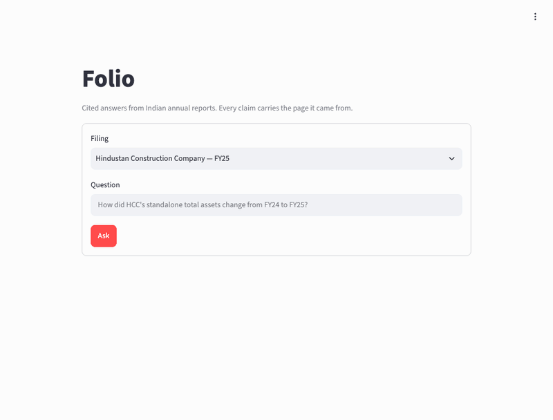
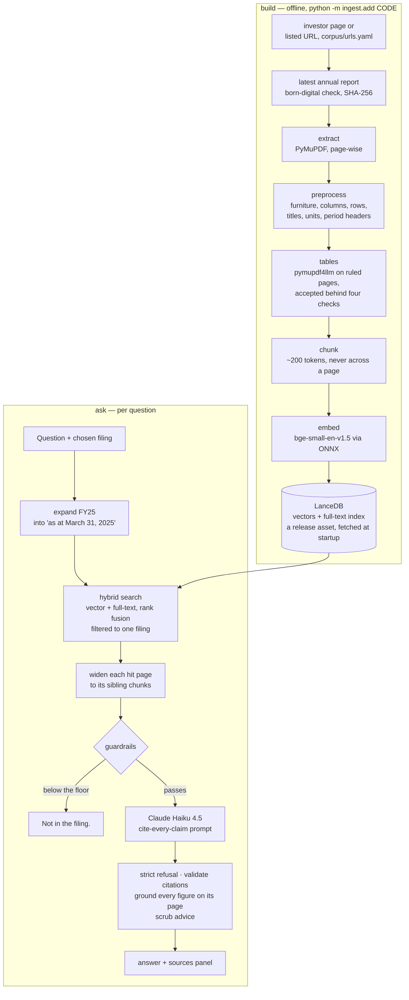

# Folio

*folio: a numbered page of a book or filing. Every claim carries the folio it came from.*

Ask a question about an Indian listed company's annual report and get an answer
where **every claim cites the page it came from** — or an honest *"Not in the
filing."*

**Live demo: [folio-india.streamlit.app](https://folio-india.streamlit.app)** · ten questions per visit



Four annual reports in one index: Hindustan Construction, Chambal Fertilisers
and Navneet Education (FY25), and Unihealth Hospitals (FY26, an NSE SME
listing), added by one command (see [Add a company](#add-a-company)).

## Why

Aggregate financial data is a solved problem. Checking a number is not. A
figure lifted out of an annual report is useless for research unless you also
know three things the page knows and a chatbot usually loses:

- **Which page it came from**, so it can be verified in seconds.
- **Its unit.** "2,28,299" means nothing until the page says *₹ in Lakhs* — and
  one of these three companies reports in lakhs while the others use crore.
- **Its scope.** Standalone and consolidated statements repeat the same row
  labels with different numbers, eighty pages apart.

Folio is built so a claim missing any of the three never reaches the reader.

## Architecture



## How a question becomes a cited answer

1. **Pick the filing.** Page numbers repeat across reports — all three have a
   page 114 — so every query is filtered to one company. Comparing companies is
   a later feature, not something search should do by accident.
2. **Expand the fiscal year.** Questions say "FY25"; statements say "As at
   March 31, 2025". The words never meet, so the period-end date is appended
   by rule, never by a model call.
3. **Search twice and fuse.** A vector ranking finds wording; a full-text
   ranking finds labels like `TOTAL ASSETS`. Reciprocal rank fusion merges the
   two orderings without pretending their scores are comparable.
4. **Widen each hit page.** The figure asked about often sits a chunk or two
   from the wording that matched, and a sibling chunk is the same citable page,
   so pages near the top of the ranking are filled in to a token budget.
5. **Answer from the extracts only.** Each extract is labelled with the page
   from its chunk record, and the model may cite only those labels — never a
   number read out of the page, where note references and years look exactly
   like page numbers.
6. **Check what came back**, then render the answer beside every chunk the
   model read.

Chunks carry their own context: a chunk from the middle of a balance sheet
inherits that page's statement title, unit declaration and period header, so it
still knows it is the *standalone* balance sheet, reported in *₹ crore*, *as at
March 31, 2025*.

## Guardrails

No single check keeps a citation honest, so there are six.

| Check | When | What it stops |
|---|---|---|
| Similarity floor (0.67) | before the model is called | a question nothing in the filing resembles, caught before a paid call. A pre-filter only — see Limitations |
| Refusal contract in the prompt | during the call | a hedged half-answer built from plausible but unhelpful extracts |
| Strict refusal | after the call | "Not in the filing." followed by anything: the rest is cut, so a refusal is always one sentence |
| Citation validation | after the call | a page the model was never shown; an answer whose citations were all invented, or which carried none, is withheld entirely |
| Figure grounding | after the call | a figure that is not printed on the page it cites. If exactly one page the model was shown prints all of a claim's figures, the citation is moved there and the reader is told; otherwise the figure is flagged. A computed figure must say "(computed from [page N])" |
| Advice scrub | after the call | investment advice, which this project never produces |

Every `[page N]` in an answer links to the issuer's PDF opened at that page.

## The corpus, and a worked example

Four filings, listed with their exact download URL and SHA-256 in
[`corpus/SOURCES.md`](corpus/SOURCES.md); `corpus/corpus.json` carries the same
in machine-readable form, and the build verifies every checksum before
indexing. The PDFs themselves are not committed.

**The lakhs-versus-crore trap.** Navneet Education's standalone balance sheet
prints:

```
STANDALONE BALANCE SHEET
AS AT 31st MARCH, 2025
(₹ in Lakhs)
Particulars | Notes | As at 31st March, 2025 | As at 31st March, 2024
...
TOTAL ASSETS | 2,28,299 | 1,74,089
```

The other two filings report in crore. Read "2,28,299" with the wrong unit and
the answer is wrong by a factor of a hundred, while still citing the correct
page. So the unit line is treated as load-bearing throughout: it is never
stripped as repeated page furniture, it is carried into every chunk of its
page, and the prompt forbids naming a unit the extract does not state — an
answer must say the page gives no unit rather than assume one.

## Run locally

```bash
git clone https://github.com/shivank2703/folio.git && cd folio
python3 -m venv .venv && .venv/bin/python -m pip install -r requirements.txt
.venv/bin/streamlit run streamlit_app.py
```

Python 3.13. Nothing is built to try it: on first start the app downloads the
search index named in `corpus/index.json` (a release asset, ~14 MB) and checks
its SHA-256. **No API key is needed** for retrieval, the sources panel or the
refusal path — only for generating prose answers. To add a key, copy
`.streamlit/secrets.toml.example` to `.streamlit/secrets.toml`, or put
`ANTHROPIC_API_KEY=` in a `.env` file.

Rebuilding everything from source, after downloading the PDFs named in
`corpus/SOURCES.md` into `corpus/`: `.venv/bin/python -m ingest.build`.
Retrieval alone, with no key and no UI: `.venv/bin/python -m retrieve.smoke`.
The answer-quality eval (spends API credit, about $0.50 a run):
`.venv/bin/python -m evals.score --label mine`.

## Add a company

One offline command finds a listed company's latest annual report, downloads
it, checks it, and indexes it — that filing only, not the whole corpus:

```bash
.venv/bin/python -m ingest.add UNIHEALTH          # one company
.venv/bin/python -m ingest.add UNIHEALTH HCC      # several
.venv/bin/python -m ingest.add HCC --verify       # re-download, compare SHA-256, change nothing
.venv/bin/python -m ingest.publish                # upload the index; commit corpus/index.json
```

A company is one entry in [`corpus/urls.yaml`](corpus/urls.yaml): its investor
page, report URLs kept by hand, or both. The command reads every PDF the page
links, works out each report's fiscal year from its link text or its own first
pages, and takes the latest. It refuses a report whose pages are more than 20%
images with no text (there is no OCR path), records the URL and SHA-256 in
`corpus.json` and `SOURCES.md`, and replaces only that company's rows in the
index. Run it again and nothing changes.

Where reports can come from, checked with plain, self-identifying requests
that respect robots.txt and wait between calls:

| Source | Find reports | Download a report |
|---|---|---|
| Company investor-relations pages | yes | yes |
| NSE file archive (archives.nseindia.com) | no — no listing to read | yes, from a URL in `urls.yaml` |
| NSE website and annual-report API | no — scripted requests are reset | — |
| BSE | no — its API answers "Access Denied" | — |

Folio does not imitate a browser to get past a site that refuses scripts; a
blocked company's report URL goes in `urls.yaml` by hand.

## Measured

Answer quality on 20 questions — 15 answerable (lookups, three tables from the
pages extraction handles worst, a two-column page, a computed figure, a
multi-hop, a lakhs-vs-crore trap) and 5 not in the filing — each answered three
times through the app's own path ([evals/RESULTS.md](evals/RESULTS.md)).
Correctness is judged by Haiku 4.5 without the pages; faithfulness by a second
Haiku call without the reference answer.

| | Before (v1.0) | Now (v1.1) |
|---|---|---|
| Answerable questions passed | 34/45 (76%) | **43/45 (96%)** |
| Correct figure, unit, period and scope | 42/45 (93%) | **45/45 (100%)** |
| Every claim supported by the cited page | 34/45 (76%) | **44/45 (98%)** |
| Not in the filing: bare refusal | 13/15 (87%) | **15/15 (100%)** |

What moved it: computed figures labelled with their inputs cited; refusals cut
to one sentence; every figure checked against the page it cites; extracts no
longer numbered ("[2] page 190" made the model cite page 2); ruled tables
re-read by pymupdf4llm. A cross-encoder reranker was tried as the refusal gate
and **not shipped**: fitted on half the questions, it lost answers on the other
half (26/27 → 19/27).

| | |
|---|---|
| Corpus | 3 filings, 896 pages → 4,773 chunks, index 10.8 MB; 202 pages' tables read by pymupdf4llm |
| Rebuild | 8 min 50 s end to end (ingest with tables 372 s, embed 154 s) |
| Retrieval, 20 questions | 13/15 expected pages in the top 5; 13/15 answer text inside the context |
| Warm retrieval | ~21 ms search, ~10 ms page expansion |
| Live answer time | 1.4–1.6 s for a cited answer, ~0.1 s for a refusal at the floor |

## Limitations

Stated plainly, because overclaiming is the failure this project is built
against:

- **The similarity floor does not separate answerable questions from
  unanswerable ones**, measured: the weakest answerable question scores
  0.702 and the strongest not-in-filing one 0.697. It stays as a cheap
  pre-filter for gross mismatches, and has refused no answerable question in
  any eval run; refusal rests on the prompt contract plus the strict-refusal
  cut, which refused all 15 not-in-filing samples. A cross-encoder gate was
  tried and lost answers on held-out questions.
- **Five not-in-filing questions are too few to fit a refusal threshold.**
  That is part of why the reranker's threshold did not hold; the eval needs
  more negatives before the next attempt.
- **The expansion width was tuned on the same nine questions.** Eight seed
  chunks and a 6,000-token budget is the smallest setting that put every
  answer in front of the model on this set; it is a fitted number, not a
  derived one.
- **Adding filings shifts retrieval for the ones already there.** Full-text
  scores use collection-wide word statistics, so a third report moved one
  page's rank even though queries are filtered to one company. The wider
  expansion absorbs that today; more documents may not be so forgiving.
- **One fiscal year, one filing per question.** Multi-year ingest and
  comparing companies in a single answer are not built.
- **Notes pages carry no standalone/consolidated tag.** Statement pages do, via
  their titles, so a balance-sheet chunk knows which it is. A note does not:
  for a question about receivables ageing, the consolidated schedule can
  outrank the standalone one, and only the page number distinguishes them.
- **Tables are read well only where they are ruled.** pymupdf4llm reads
  gridded notes exactly (ageing schedules, borrowings, cash flow), but merges
  whole columns on shaded statements and fails on rotated ones, so it is
  accepted page by page behind four checks, and 670 of 872 pages keep the
  geometry-based reading. Statements of changes in equity and sustainability
  grids remain the weakest pages.
- **The embedding model is a quantized export**, so published benchmark scores
  describe slightly different weights.
- **The judge is a model.** Read by hand, it made three mistakes in the
  runs above (it called "(146.98)" bad arithmetic, and "5.8 km" computed when
  the page prints it). It was kept frozen across the step so that every run is
  graded the same way; disagreements are listed in evals/RESULTS.md.
- **The ten-question limit is per browser session.** A refresh resets it; the
  real ceiling is a monthly spend limit on the demo's API key.
- **Not advice.** The system reports what a filing says. It produces no
  recommendations and strips advice language if a model drifts into it.

## Roadmap

One step per Saturday ([SPEC.md §4](SPEC.md)):

- **Public** (03 Oct 2026, v1.0): cited Q&A over three annual reports, deployed.
- **Accurate** (04 Oct 2026, v1.1, this release): a 20-question eval with a
  Haiku judge; figure-level citation checks; labelled computed figures; strict
  refusals; ruled tables via pymupdf4llm. Reranker measured and not shipped.
- **Ingest** (10 Oct): one offline command that finds a listed company's latest
  annual report, checks it is born-digital, records its URL and checksum, and
  indexes it; a batch mode; and a decision on where the index lives once it
  outgrows git.
- **Funds** (17 Oct): mutual fund mode. Holdings and weights from a fund's
  monthly portfolio disclosure, read as a table; expense ratio, benchmark and
  exit load from its factsheet; the top 10–15 holdings drilled into through the
  annual-report Q&A (companies indexed by Ingest). Every claim cited, no buy or
  sell language.
- **Agent** (24 Oct): one plain Anthropic tool-use loop over company and fund
  tools, producing a one-page memo with every sentence cited.

Cut: RAGAS in CI, LangGraph, Langfuse. Later, maybe: trend charts, multi-year
ingest, an in-app "add a company" button, daily exchange-disclosure flags.

## Data and licence

The source PDFs are public statutory filings and are **not** committed;
`corpus/SOURCES.md` records each exact URL and SHA-256. The derived chunk index
is published as an asset on this repository's `index` release (it was committed
until v1.1) and fetched by the app at startup, with attribution to each issuing
company and a link to its source document.

Licensed under [AGPL-3.0](LICENSE), matching PyMuPDF's terms for a
network-served application.
