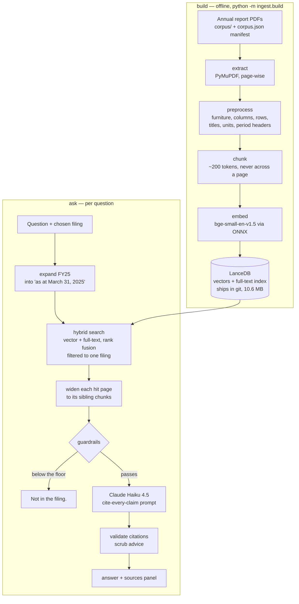

# Folio

*folio: a numbered page of a book or filing. Every claim carries the folio it came from.*

Ask a question about an Indian listed company's annual report and get an answer
where **every claim cites the page it came from** — or an honest *"Not in the
filing."*

**Live demo: [folio-india.streamlit.app](https://folio-india.streamlit.app)** · ten questions per visit


Three FY25 annual reports, 896 pages, 4,704 chunks in one index: Hindustan
Construction, Chambal Fertilisers, and Navneet Education.

## Why

Aggregate financial data is a solved problem. Checking a number is not. A
figure lifted out of an annual report is useless for research unless you also
know three things the page knows and a chatbot usually loses:

- **Which page it came from**, so it can be verified in seconds.
- **Its unit.** "2,28,299" means nothing until the page says *₹ in Lakhs* — and
  one of these three companies reports in lakhs while the others use crore.
- **Its scope.** Standalone and consolidated statements repeat the same row
  labels with different numbers, eighty pages apart.

Folio is built so a claim missing any of the three never reaches the reader.

## Architecture



## How a question becomes a cited answer

1. **Pick the filing.** Page numbers repeat across reports — all three have a
   page 114 — so every query is filtered to one company. Comparing companies is
   a later feature, not something search should do by accident.
2. **Expand the fiscal year.** Questions say "FY25"; statements say "As at
   March 31, 2025". The words never meet, so the period-end date is appended
   by rule, never by a model call.
3. **Search twice and fuse.** A vector ranking finds wording; a full-text
   ranking finds labels like `TOTAL ASSETS`. Reciprocal rank fusion merges the
   two orderings without pretending their scores are comparable.
4. **Widen each hit page.** The figure asked about often sits a chunk or two
   from the wording that matched, and a sibling chunk is the same citable page,
   so pages near the top of the ranking are filled in to a token budget.
5. **Answer from the extracts only.** Each extract is labelled with the page
   from its chunk record, and the model may cite only those labels — never a
   number read out of the page, where note references and years look exactly
   like page numbers.
6. **Check what came back**, then render the answer beside every chunk the
   model read.

Chunks carry their own context: a chunk from the middle of a balance sheet
inherits that page's statement title, unit declaration and period header, so it
still knows it is the *standalone* balance sheet, reported in *₹ crore*, *as at
March 31, 2025*.

## Guardrails

Four checks, because no single one keeps a citation honest.

| Check | When | What it stops |
|---|---|---|
| Similarity floor (0.67) | before the model is called | a question nothing in the filing resembles, caught before a paid call. It catches gross mismatches only — see Limitations |
| Refusal contract in the prompt | during the call | a hedged half-answer built from plausible but unhelpful extracts |
| Citation validation | after the call | a page the model was never shown; an answer whose citations were all invented, or which carried none, is withheld entirely |
| Advice scrub | after the call | investment advice, which this project never produces |

## The corpus, and a worked example

Three filings, listed with their exact download URL and SHA-256 in
[`corpus/SOURCES.md`](corpus/SOURCES.md); `corpus/corpus.json` carries the same
in machine-readable form, and the build verifies every checksum before
indexing. The PDFs themselves are not committed.

**The lakhs-versus-crore trap.** Navneet Education's standalone balance sheet
prints:

```
STANDALONE BALANCE SHEET
AS AT 31st MARCH, 2025
(₹ in Lakhs)
Particulars | Notes | As at 31st March, 2025 | As at 31st March, 2024
...
TOTAL ASSETS | 2,28,299 | 1,74,089
```

The other two filings report in crore. Read "2,28,299" with the wrong unit and
the answer is wrong by a factor of a hundred, while still citing the correct
page. So the unit line is treated as load-bearing throughout: it is never
stripped as repeated page furniture, it is carried into every chunk of its
page, and the prompt forbids naming a unit the extract does not state — an
answer must say the page gives no unit rather than assume one.

## Run locally

```bash
git clone https://github.com/shivank2703/folio.git && cd folio
python3 -m venv .venv && .venv/bin/python -m pip install -r requirements.txt
.venv/bin/streamlit run streamlit_app.py
```

Python 3.13. The search index ships in the repository, so nothing is rebuilt to
try it, and **no API key is needed** for retrieval, the sources panel or the
refusal path — only for generating prose answers. To add a key, copy
`.streamlit/secrets.toml.example` to `.streamlit/secrets.toml`, or put
`ANTHROPIC_API_KEY=` in a `.env` file.

Rebuilding from source, after downloading the PDFs named in `corpus/SOURCES.md`
into `corpus/`:

```bash
.venv/bin/python -m ingest.build
```

Adding a company means adding its PDF and one manifest entry — no code changes.
Retrieval alone, with no key and no UI: `.venv/bin/python -m retrieve.smoke`.

## Measured

| | |
|---|---|
| Corpus | 3 filings, 896 pages → 4,704 chunks, index 10.6 MB |
| Rebuild | 2 min 37 s end to end (ingest 19 s, embed 139 s) |
| Answers, 11 eval questions | 8/8 answerable questions correct with a valid page citation (scope and lakhs traps included); 3/3 not-in-filing questions refused |
| Retrieval, same questions | 7/8 expected pages in the top 5 |
| Answer availability | 8/8 questions have the answer-bearing chunk in context |
| Refusal margin | +0.006 — weakest answerable 0.702, strongest not-in-filing 0.696. The floor no longer separates them (see Limitations) |
| Warm retrieval | ~21 ms search, ~10 ms page expansion |
| Live answer time | 1.4–1.6 s for a cited answer, ~0.1 s for a refusal at the floor |

## Limitations

Stated plainly, because overclaiming is the failure this project is built
against:

- **The similarity floor no longer separates answerable questions from
  unanswerable ones**, and this is measured, not suspected. It was calibrated
  on one not-in-filing question, whose best score was 0.644. Giving each of the
  three filings its own negative — plausible questions in the document's own
  vocabulary, absent from it — put two of them at 0.695 and 0.696, above the
  0.67 floor. The weakest answerable question scores 0.702, so the only
  separating threshold is a 0.006-wide window, which is noise. The floor is
  left where it is rather than fitted into that window: it still stops a
  grossly unrelated question cheaply, but refusal now rests on the prompt's
  refusal contract, the layer that reads the extracts instead of a number
  about them. Measured: all three negatives are refused, but the contract
  leaks. Asked about Navneet's television advertising, the model sometimes
  replies "Not in the filing." and then adds a true, cited sentence about
  total advertising spend, which passes every check and is shown as an answer.
  A reranker replaces the floor in the next step.
- **The expansion width was tuned on the same nine questions.** Eight seed
  chunks and a 6,000-token budget is the smallest setting that put every
  answer in front of the model on this set; it is a fitted number, not a
  derived one.
- **Adding filings shifts retrieval for the ones already there.** Full-text
  scores use collection-wide word statistics, so a third report moved one
  page's rank even though queries are filtered to one company. The wider
  expansion absorbs that today; more documents may not be so forgiving.
- **One fiscal year, one filing per question.** Multi-year ingest and
  comparing companies in a single answer are not built.
- **Notes pages carry no standalone/consolidated tag.** Statement pages do, via
  their titles, so a balance-sheet chunk knows which it is. A note does not:
  for a question about receivables ageing, the consolidated schedule can
  outrank the standalone one, and only the page number distinguishes them.
- **Complex tables reassemble only partially** — statements of changes in
  equity, ageing schedules, sustainability grids. Core statements are clean.
- **The embedding model is a quantized export**, so published benchmark scores
  describe slightly different weights.
- **Answer quality is checked by hand, on 11 questions.** Each answer was
  compared with its recorded figure; there is no automated scoring yet. One
  pattern it showed: the model states computed differences ("an increase of
  ₹605.34 crore") that no page prints. The arithmetic is right, but the
  number has no page of its own.
- **The ten-question limit is per browser session.** A refresh resets it; the
  real ceiling is a monthly spend limit on the demo's API key.
- **Not advice.** The system reports what a filing says. It produces no
  recommendations and strips advice language if a model drifts into it.

## Roadmap

One step per Saturday ([SPEC.md §4](SPEC.md)):

- **Public** (03 Oct 2026, this release): cited Q&A over three annual reports, deployed.
- **Accurate** (10 Oct): tables read with pymupdf4llm; the eval grows to 20
  questions with answer-quality scoring (a local script, Haiku as judge); a
  cross-encoder reranker whose score replaces the 0.67 similarity floor as the
  refusal gate.
- **Funds** (17 Oct): mutual fund mode. Holdings and weights from a fund's
  monthly portfolio disclosure, read as a table; expense ratio, benchmark and
  exit load from its factsheet; the top 10–15 holdings drilled into through the
  annual-report Q&A. Every claim cited, no buy or sell language.
- **Agent** (24 Oct): one plain Anthropic tool-use loop over company and fund
  tools, producing a one-page memo with every sentence cited.

Cut: RAGAS in CI, LangGraph, Langfuse. Later, maybe: trend charts, multi-year
ingest, daily exchange-disclosure flags.

## Data and licence

The source PDFs are public statutory filings and are **not** committed;
`corpus/SOURCES.md` records each exact URL and SHA-256. The derived chunk index
is committed so the demo loads instantly, with attribution to each issuing
company and a link to its source document.

Licensed under [AGPL-3.0](LICENSE), matching PyMuPDF's terms for a
network-served application.
